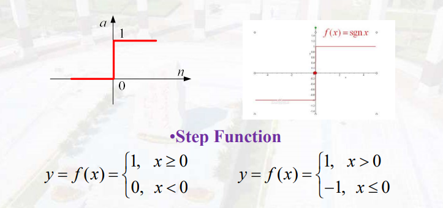
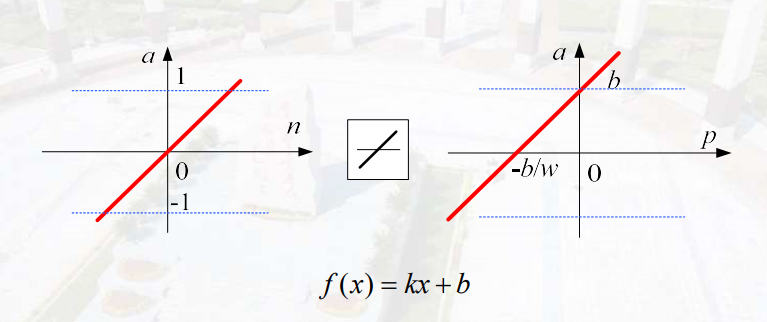
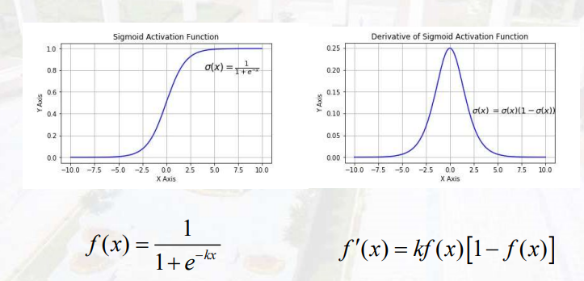
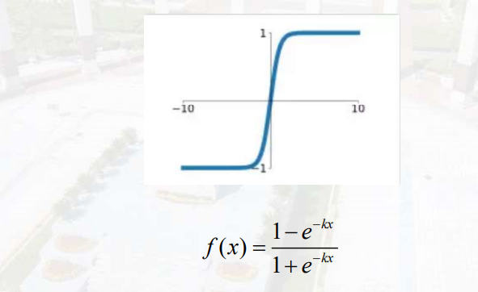
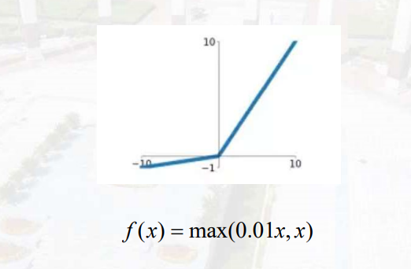
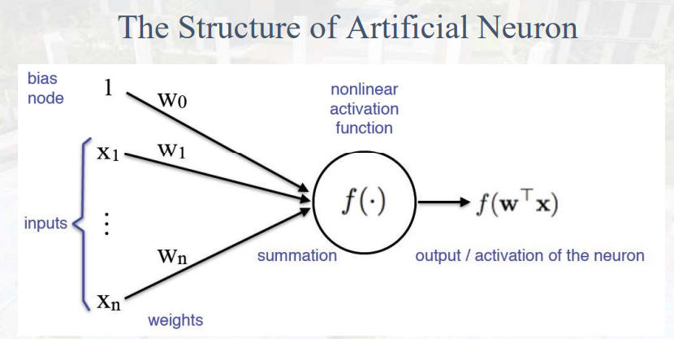
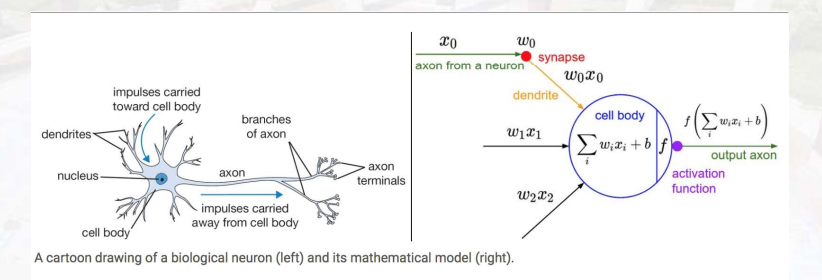

# Artificial Neural Network  

## 基础概念
基础神经信息处理机制
- Vision(图像处理)
- Attention(关注局部)
- Dopamine(多巴胺) and Reward
- Memory(处理序列数据)
- Meaning(低级信息到高级信息)
- Task directed behavior

## 大脑功能
1. input
    - 眼睛(sight)
    - 耳朵(hearing)
    - 手指(touch)
    - 舌头(taste)
    - 鼻子(smell)
2. 大脑结构
    - 内脑
        - 海马区(Memory)
        - 杏仁核(emotion/reward)
        - 丘脑(attention)
        - 基底核(final action)
        - 小脑(平衡)
    - 外脑
        - 枕叶(visual processing)
        - 颞叶(language/audio processing)
        - 前叶(执行动作)
        - 顶叶(smart)

## 生物神经元
- 细胞体(处理输入信号)
- 树突(接收信号)
- 轴突(发送信号)
- 突触(控制信号是否发送：兴奋、抑制)

## 人工神经元
- node
- input(x)
- output(y)
- bias function(b)
- connection weights(w，给输入赋予重要程度)
- avtivation function(将输出按照一定规律进行显示，就是一个数学表达)

$$  Y=f(\sum_{i=1}^n W_i X_i +b)  $$

可以将b放进X中，此时i从0开始：$W_0=1,X_0=b$

## 激活函数
1. 线性函数
    - 阶跃函数 

    $$
    y=f(x)=
    \begin{cases}
    1,\,x\geq0\\
    0,\,x<0\\
    \end{cases}
    $$
    
    - 线性激活函数

    
2. 非线性函数

    - Sigmoid 函数

    

    _两个好处：1.变成非线性；2.方便求导_

    - Tanh 函数

     

    - Relu 函数

    $$
    f(x)=\max(0,x)
    $$

    >_为什么说Relu是非线性：对于小于0的样本不关注，直接将输出置为0，相当于进行了非线性操作。但后来发现进行网络迭代的时候容易出现梯度消失，所以引入了Leaky Relu。_

    - Leaky Relu
    

## 总结

