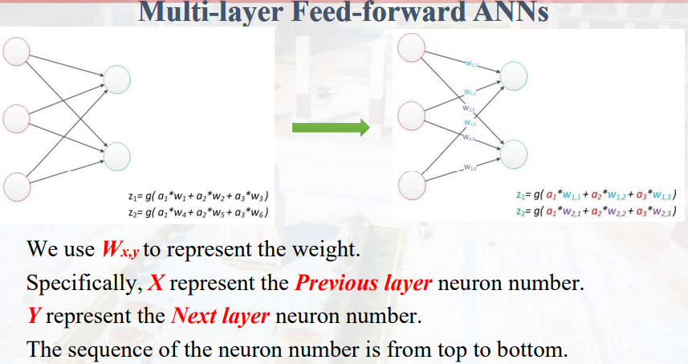
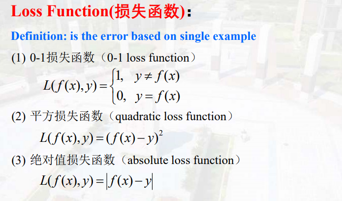
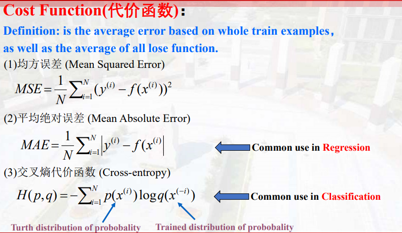
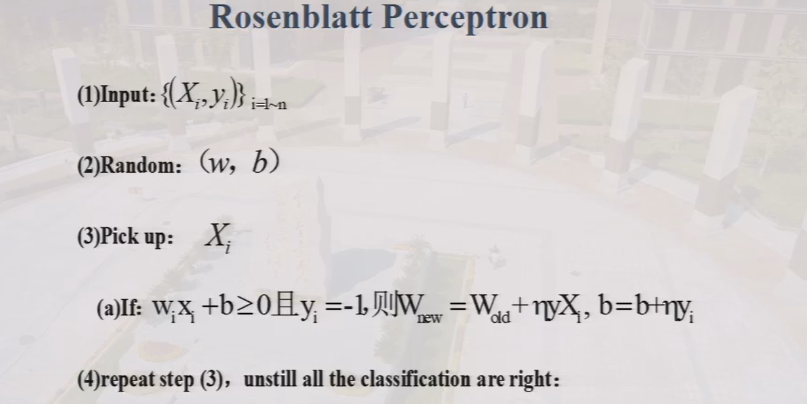

# Learning & Perceptron

## 人工神经网络

1. trail & error(试错)
    - Trail
    > 处理输入得到输出
    - Evaluate 
    > 比较真实值和预测值的差异
    - Adjust
    > 调整权重

2. 神经网络的结构

    - 输入层
    - 输出层
    - 隐藏层
    

## 损失函数
之前将损失函数(基于单个训练样本)和代价函数(全部训练样本error的平均值)分开，但现在已经统一使用了。
- Loss function

- Cost function

交叉熵损失函数：不是直接预测输出类别，而是预测类别的概率分布，将真实的概率分布与预测的概率分布比较得到loss  
**目标是最小化损失**

## Rosenblatt Perceptron
激活函数：阶跃函数

## Learning

- 监督学习（以答案为导向）
> 输入是带有label的数据，成对出现  
10-fold cross validation：每次选取九份作为训练集，一份作为验证集，训练样本数据的不同组合，使得每次训练集不同，增加模型的鲁棒性。
- 无监督学习（以数据之间相似度为导向）
> 输入的数据不带label  
既然没有label，那怎么计算误差：例如k-means是选取一些中心点，然后计算数据点到中心点的距离

- 强化学习
- 半监督学习