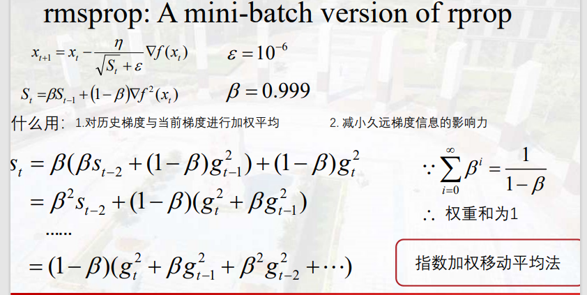

# Optimization

## 梯度下降(Gradient Descent)

导数(标量)
> 函数在某点的变化率

偏导数(标量)
> 多元函数在坐标轴正方向上的变化率。

方向导数(标量)
> 函数沿各个不同方向时函数的变化率。

梯度(矢量)
> 梯度的方向是方向导数中取到最大值的方向，梯度的模是最大方向导数。

梯度下降算法的步骤：

## Batch-size Optimization
> 优化输入X的构成方式

1. 随机梯度下降（SGD）  

2. 批量梯度下降（BGD）  

3. 小批量梯度下降（MBGD）

## Category Optimization

#### 优化下降方向  
如果只使用最速梯度下降会出现锯齿效应，收敛不理想

__动量法（momentum）__  
加入速度  
> 优点：前期加速梯度下降，后期会穿越局部极小值点  
缺点：会在极小值点震荡
$$
v_t = \alpha v_{t-1} - \eta\Delta{f(x_{t-1})}\\
x_t =x_{t-1}+v_t
$$

__Nesterov momentum__  
计算梯度的位置是沿着上一时刻的方向前行一段距离，相当于进行了预判,到达极小值点之前会提前减速。
$$
v_t = \alpha v_{t-1} - \eta\Delta{f(x_{t-1}+\alpha v_{t-1})}\\
x_t =x_{t-1}+v_t
$$

#### 优化步长

__AdaGrad__

步长（学习率）和梯度成反比
$$
S_t =S_{t-1}+\nabla f^2(x_{t})\\
x_{t+1} =x_t-\frac{\eta}{\sqrt{S_t}+\epsilon} \nabla f(x_{t})
$$

__RMSProp__

解决Adagrad中梯度消失的问题，对梯度进行加权平均。
$$
S_t =\beta S_{t-1}+(1-\beta)\nabla f^2(x_{t})\\
x_{t+1} =x_t-\frac{\eta}{\sqrt{S_t}+\epsilon} \nabla f(x_{t})
$$

___Adam___（Adaptive Moment Estimation-自适应时刻估计方法）  
同时优化下降方向和步长（学习率）

其中的误差修正能够加快训练初始阶段收敛速度：最开始速度和累计梯度很小，所以除以一个小于零的数能让初始速度和累计梯度变大；随着时间增加，$\alpha^t$和$\beta^t$趋近于0，分母趋近于1，因此误差修正不起作用。

学习率主要的衰减方式：

## Back-propagation Algorithm（反向传播）

步骤：先进行前向计算得到误差，然后进行反向传播误差来更新参数。  
权重更新时是全部权重一次性更新而不是一层一层更新，因为目标函数是基于旧的节点计算得到的，所以需要用误差反向传播到所有的节点后一起更新。

