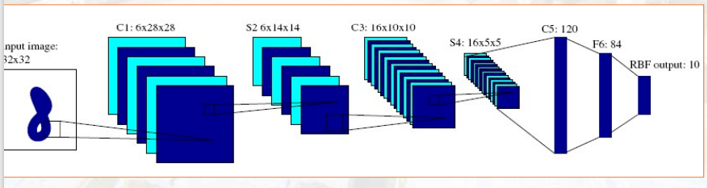
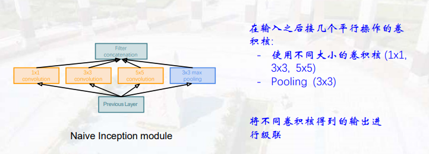
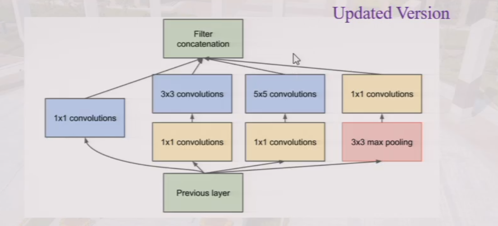
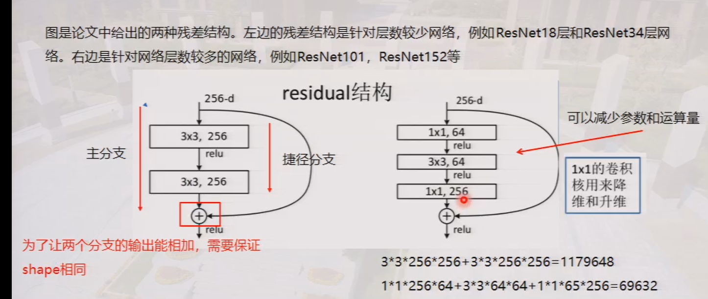
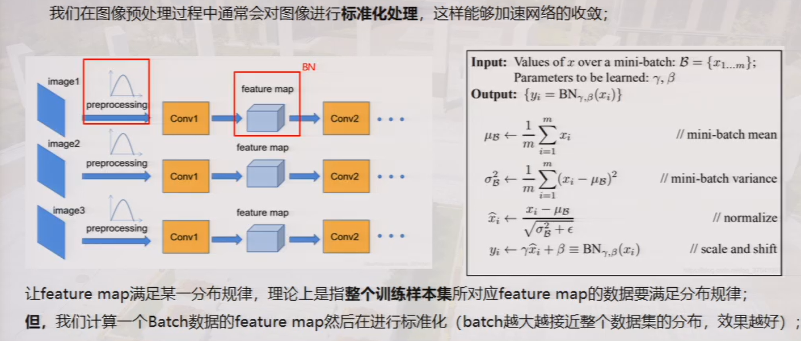
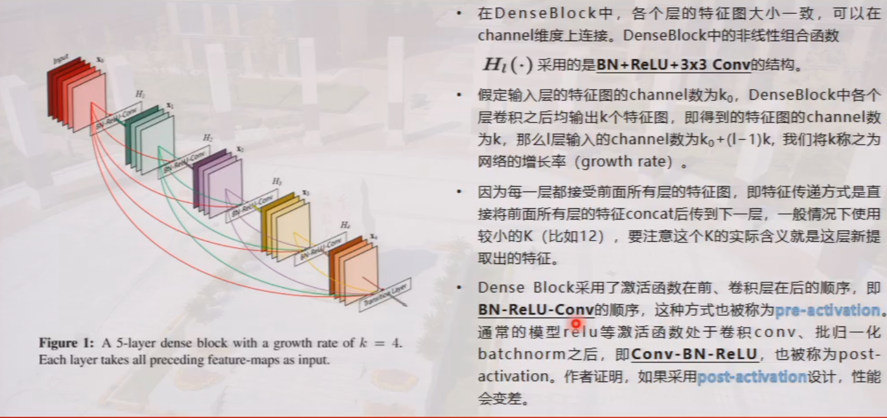
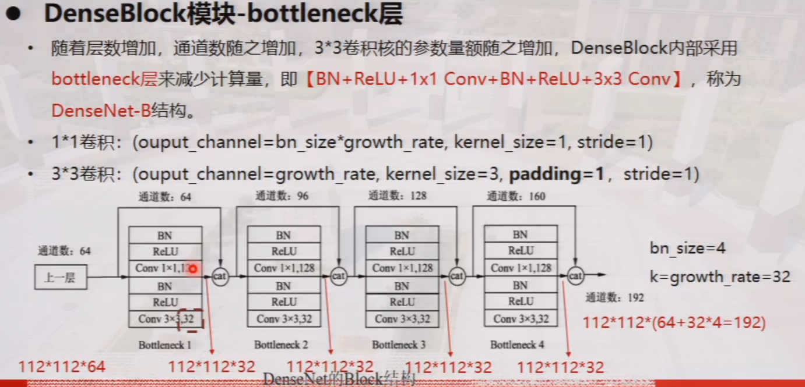
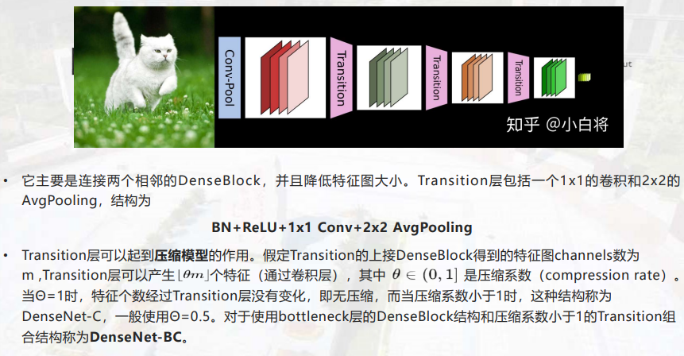

# Convolutional Neural Network

## 感受野（Receptive Field）

视觉信息产生的过程：光的方向(low level)->光的移动(mid level)->光的边缘(high level)

## ConvNet Topology（拓扑结构）

有三种类型的层级结构：
1. Convolution layer(提取图像特征)
2. Pooling/Subsampling layer(减少像素点保持空间位置信息的同时减少运算量)
    - 最大池化
    - 平均池化
    - 范数池化
    - 对数概率池化
3. Fully connected layer(flatten，softmax得到输出概率)

## 局部连接和权重共享（卷积神经网络的两大优点）

$$
Featuremap_{size} = \lfloor \frac{image_{size}-kernel_{size}+2\times padding_{size}}{stride} \rfloor +1
$$
卷积核的个数决定了特征图的通道数，每个卷积核的通道数应该与输入图像通道数相等。

## 卷积神经网络

> 思考题：卷积处理（一个多通道的特征图和一个卷积核）为什么采用第二种而不采用第一种:  
    1. 将特征图通道数变为1与后面的 kernel 卷积：这意味着对于每个位置，所有通道的信息都被整合到一个单一的值中。这样的操作可以看作是对整个特征图进行综合考虑，将多个通道的信息进行压缩。这样做可能导致信息的丢失，因为通道内的特定信息可能在整合过程中被混合或忽略。  
    2. 将 kernel 通道数复制成和特征图通道数相同，再做卷积，然后再将得到的特征图通道数变为1：这种方式保持了通道的维度一致性。通过将 kernel 的通道数复制成和特征图通道数相同，实际上是为每个通道分配了一个对应的 kernel。这样可以在每个通道上进行特征的提取和学习，而不会混淆通道之间的信息。后续再将得到的特征图通道数变为1，可以看作是对每个通道的信息进行了整合，得到了最终的特征图。

## LeNet

## AlexNet

改进：  
1. Relu 代替 Sigmoid
2. 使用dropout(每次随机抑制（遗忘）一些神经元，使得提取到的特征更具有通用性和普遍性，从而来提升模型的泛化能力防止过拟合，卷积神经网络中的神经元相当于提取某种特定特征的卷积核)
3. 提出了LRN(局部响应)

## VGG & GoogleNet
VGG是用更小的卷积，搭建更深的网络  

GoogleNet 改进：  
1. 引入Inception结构  
inception的作用：使用不同大小的卷积提取不同尺度的特征，然后把这些特征拼接起来保留了不同尺度的信息。
  

由于第一种结构会增加参数量，因此引入1*1卷积先对特征图降维再进行卷积操作从而降低参数量。  
为什么要在最右边加一个max pooling：可以保留一些原始特征，将其与提取的特征融合可以得到更好的特征表示
2. 1*1卷积核
    - 提取特征
    - 降维
     > 为什么右边的1*1卷积在max pooling之后：MaxPooling操作通常用于减小空间分辨率，但可能导致信息损失。在MaxPooling之后使用1x1卷积可以在降低空间分辨率的同时，保持通道数并引入非线性映射，以提高网络的表达能力。
3. Fusion  
输出多个结果来决策最终结果

## ResNet

1. residual(残差)  
主要减轻梯度消失、梯度爆炸和退化问题（当网络很深时，会遗忘低阶特征，效果会变得很差，退化现象：浅层网络都比深层网络表现得好）

是一种加和操作，而不是concat操作

2. Batch Normalization

**注：Batch Normalization和 dropout不能同时使用：因为归一化就是将得到的特征图减去均值除以标准差的操作，如果使用dropout将会随机将某些特征图丢掉，将会影响一个batch中统计信息的分布，从而干扰Batch Normalization**

## DenseNet

1. 特征复用
2. Dense block & Transition

DenseNet中采用pre-activation结构的主要作用是通过提前进行归一化和激活操作，缓解梯度消失问题，促进信息流动，支持更深的网络结构，并更加高效地利用参数。  
为了降低参数量，在Dense block中采用1*1卷积降低通道数；在Dense block之间使用transition（1\*1conv+2*2polling）来降低特征图大小。
3. bottleneck

4. transition

优点：
- 更强的梯度流动，减轻梯度消失
- 减少参数数量
- 保存了低维度的特征