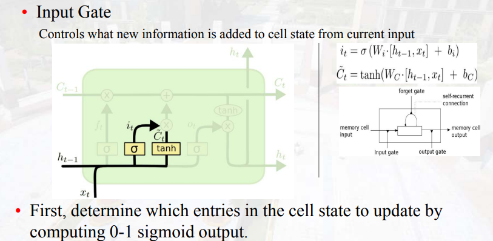

# Recurrent Neural Network

## 结构图  
  

根据输入输出长度对RNN任务进行分类  

- 一对一：前馈网络
- 一对多：image caption
- 多对一：情感识别
- 多对多：机器翻译

RNN的简单计算  
一定要将隐藏状态保存，并且用于下一时刻的计算

## BPPT(沿着时间序列反向传播)

长程依赖问题：对很长序列进行预测时，需要与较早时间步的信息建立依赖关系。
随着时间长度的增加，在进行梯度反向传播时，由于需要使用链式法则，会将很多偏导项进行连乘，当偏导项都是小1，会产生梯度消失或偏导项都是大于1会产生梯度爆炸问题。（对信息不加选择的存储）

## LSTM

除了有隐藏状态$h_t$，还有细胞状态$C_t$  

门控机制：(门控的权重是由上一时刻的隐藏状态和当前时刻的输入决定的，通过sigmoid将权重置于0-1)
- 遗忘门(遗忘信息)  
计算历史记忆中的信息与当前输入的相关性，对其进行保留或遗忘
$$
f_t =\sigma(W_f [h_{t-1},x_t]+b_f)
$$

- 输入门(添加信息)  
确定当下输入中哪些输入信息被保留下来使用  
$$
i_t =\sigma(W_i[h_{t-1},x_t]+b_i) \\
\widehat{C_t} =\tanh(W_c[h_{t-1},x_t]+b_c)
$$
$i_t$表示输入信息要保留的权重，$\widehat{C_t}$表示输入信息，只不过进行了一个非线性映射

$$
C_t =f_t \times C_{t-1}+ i_t \times \widehat{C_T}
$$
根据输入信息和上一时刻隐藏状态决定历史细胞状态中要遗忘的信息，并且将保留下来的信息与最终决定的输入信息相加得到新的细胞状态

- 输出门  
控制当前细胞状态$C_t$有多少信息需要输出
$$
O_t = \sigma(W_o[h_{t-1},x_t]+b_o)\\
h_t =O_t\times tanh(C_t)
$$

## GRU

重置门  
控制上一时刻隐藏状态有多少信息被用来计算候选隐藏状态(捕获短期记忆)  
$$
r_t =\sigma(W_r[h_{t-1},x_t]+b_r)\\
\widehat{h_t} = tanh(W [r_t*h_{t-1},x_t])
$$
更新门   
控制候选隐藏状态中有多少信息被用来更新当前时刻的隐藏状态(处理长期记忆)
$$
z_t =\sigma(W_r[h_{t-1},x_t]+b_z)\\
h_t =(1-z_t)*h_{t-1}+z_t*\widehat{h_t} 
$$

GRU与LSTM的对比

